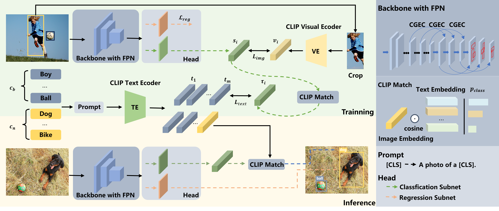
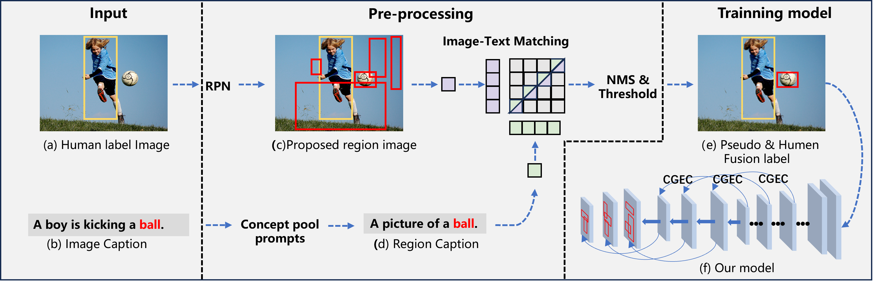
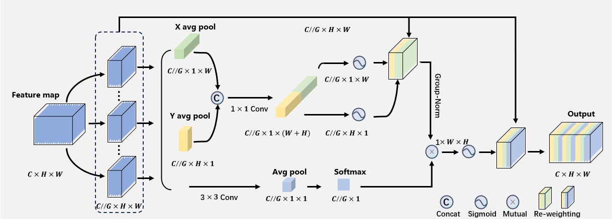

# CLIP-YOLO:Single-Stage Zero-Shot Object Detection Network Based on CLIP and Pseudo-Labelling

### Abstract
The detection of unknown objects is a challenging task in computer vision because, although there are diverse real-world detection object categories, existing object-detection training sets cover a limited number of object categories . Most existing approaches use two-stage networks to improve a model's ability to characterize objects of unknown classes, which leads to slow inference. \textcolor{red}{To address this issue, we proposed a single-stage unknown object detection method based on the contrastive language-image pre-training (CLIP) model and pseudo-labelling, called CLIP-YOLO. First, a visual language embedding alignment method is introduced and, a channel-grouped enhanced coordinate attention module is embedded into a YOLO-series detection head and feature-enhancing component, to improve the model’s ability to characterize and detect unknown category objects. }Second, the pseudo-labelling generation is optimized based on the CLIP model to expand the diversity of the training set and enhance the ability to cover unknown object categories.  \textcolor{red}{We validated this method on four challenging datasets: MSCOCO, ILSVRC, Visual Genome, and PASCAL VOC. The results show that our method can achieve higher accuracy and faster speed, so as to obtain better performance of unknown object detection.

### Contributions
1) A single-stage zero-shot detection framework is proposed. This framework effectively transfers the zero-shot classification capability of the CLIP model by replacing the traditional class output with a visual-language embedding alignment method in the detection head. \textcolor{red}{The channel grouping enhanced attention (CGEC) module is introduced in the feature enhancement part. Compared with previous methods, the model's representation ability for objects of unknown categories is further enhanced without increasing the number of network parameters.
2) A pseudo-labelling generation method based on the combination of CLIP, a visual language multimodal model, and RPN (Region Proposal Networks) is proposed. The pseudo-labelling annotation of the RPN proposal region is optimized by using the prior knowledge of CLIP multimodality. \textcolor{red}{Compared with the method of pseudo-labelling generation using a single visual modality pre-trained model, it expands the diversity of training set categories and enhances the coverage of unknown category objects.
3) We verify that the proposed method achieves a balance between unknown object detection accuracy and speed on the challenging datasets MSCOCO, ILSVRC, Visual Genome, and PASCAL VOC, and verify the effectiveness of the proposed CGEC module and pseudo-labelling region optimization method in zero-shot detection through ablation.

### Code
The code for this program will be published soon.
